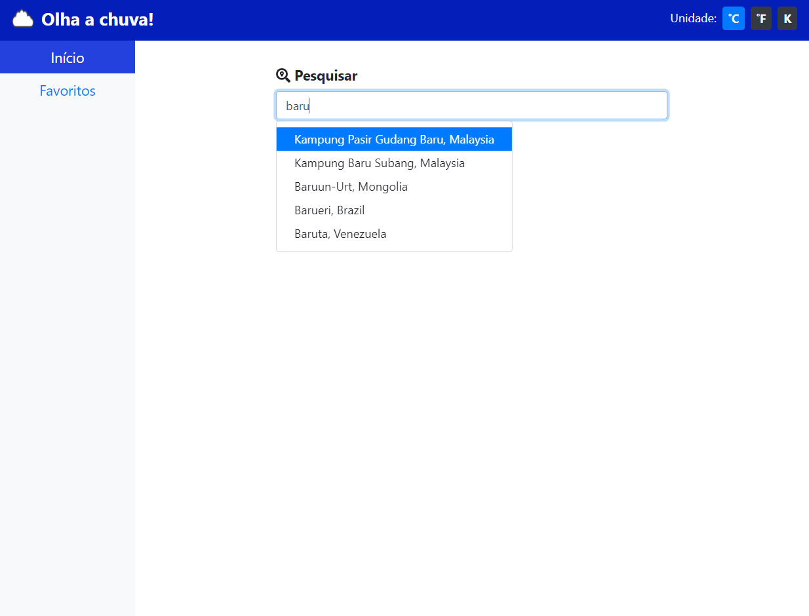
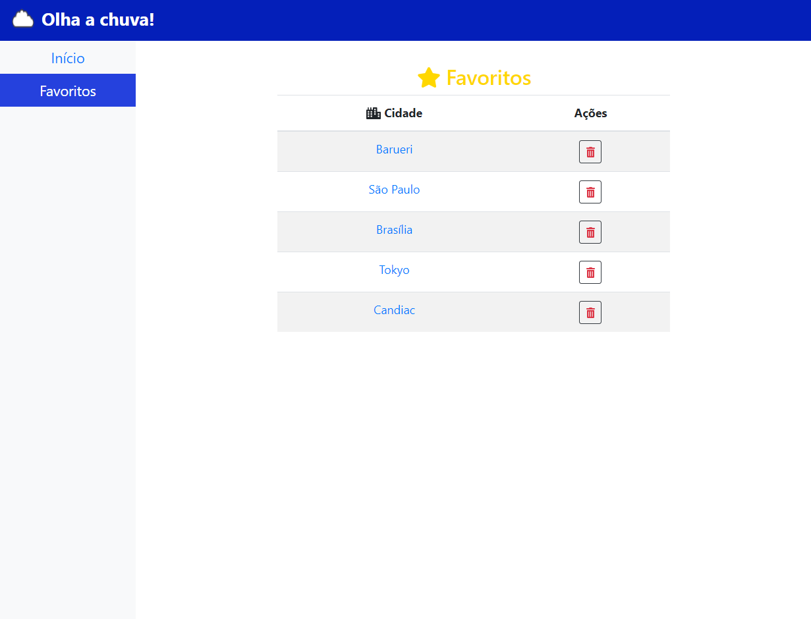
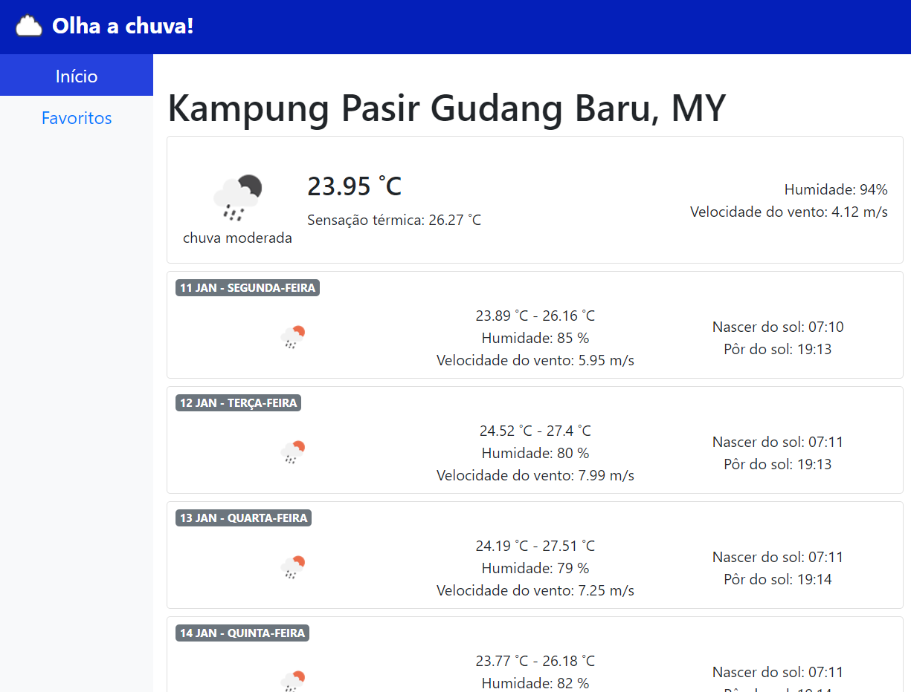

# ⛅ Olha a chuva! 🌧

  

    
  

  
  

    
  

  
  

    
  

Projeto feito em Angular 9, que consulta a previsão do tempo da sua cidade preferida, via API.

  
 

 

  <a href="https://digitalinnovation.one/sign-up?ref=H395IYS4Z6">SE INSCREVER</a>
 

